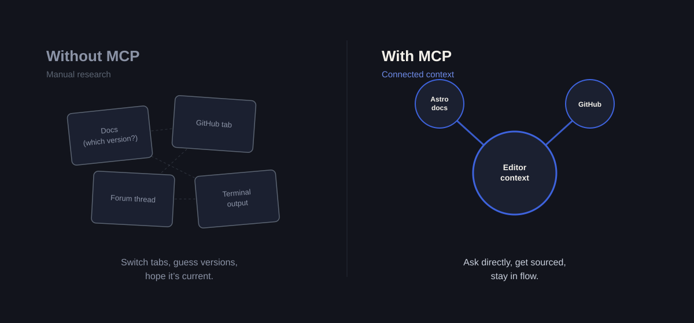
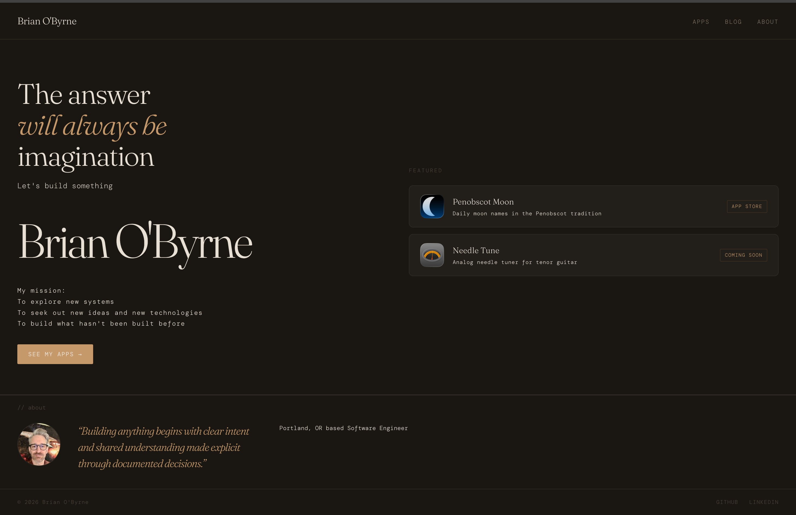
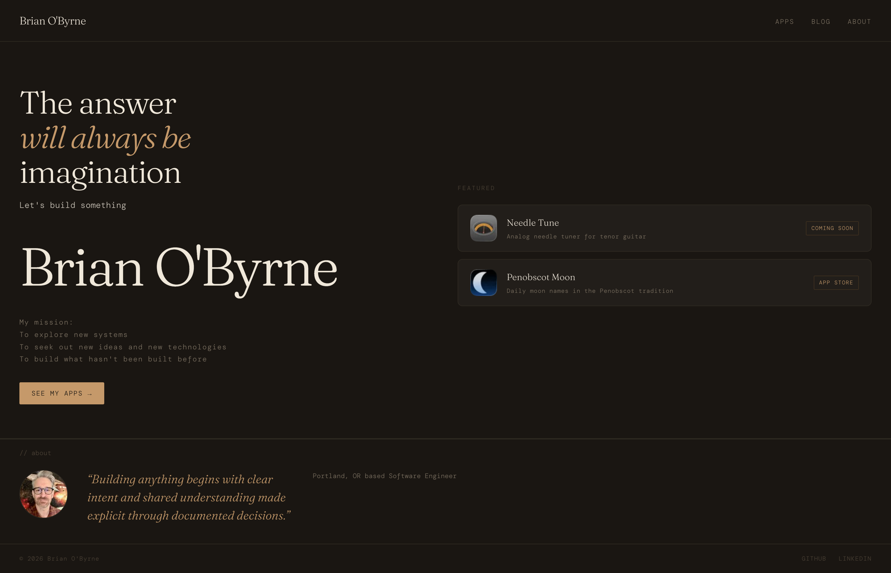

Migrating a site usually means a browser full of tabs — docs in one, your repo in another, Stack Overflow in a third. This time was different.

We moved this site from Jekyll to Astro using two MCP connectors: **Astro's official docs server** and **GitHub**. Both plugged directly into our workflow, and the difference was immediate.

Here's the actual `.mcp.json` config — both servers are just `http` entries, so adding the second one is another block under the same `mcpServers` key:

```json
{
  "mcpServers": {
    "Astro docs": {
      "type": "http",
      "url": "https://mcp.docs.astro.build/mcp"
    },
    "github": {
      "type": "http",
      "url": "https://api.githubcopilot.com/mcp/",
      "headers": {
        "Authorization": "Bearer ${GITHUB_TOKEN}"
      }
    }
  }
}
```

Astro's server needs no auth — it's a free, public documentation index. GitHub's server authenticates with a personal access token, and the `${GITHUB_TOKEN}` syntax is Claude Code expanding an environment variable at connect time, so the real token lives in the shell (`export GITHUB_TOKEN=ghp_...`) and never gets committed to the file. The same config can be generated without hand-editing JSON:

```bash
claude mcp add --transport http github https://api.githubcopilot.com/mcp/ \
  --header "Authorization: Bearer YOUR_GITHUB_PAT"
```

**Astro's MCP server** meant we were never guessing. Instead of searching for a doc page and hoping it matched our version, we could ask directly and get an answer sourced from Astro's current documentation — accurate, in context, no tab-switching.

**GitHub's MCP server** did the same for the repo side. Branches, commits, and PRs happened without breaking flow to open GitHub in another window.



### What the homepage actually looked like, before and after

Here's the site running on Jekyll, right before the migration:



And here's the homepage today, on Astro:



Side by side, the migration itself reads as almost a non-event — the dark, warm design, the copy, the layout all carried straight over. (The only visible difference is the order of the two featured apps, which is a separate stream-sorting story, not a migration artifact.) That was the point: the risk was in the toolchain underneath, not in how the site looks.

The homepage did go through a more dramatic-looking phase in between, when I reset the design to [Astro's own blog example](https://github.com/withastro/astro/tree/main/examples/blog) as a clean baseline before building the current custom look — but that reset, and the redesign after it, is a separate story from the migration itself.

The pattern is simple: when your tools are connected directly into the context where you're working, the friction that normally comes with migrating — hunting for the right doc, jumping apps to check a repo state — mostly disappears. We spent our time building, not searching.

That's the real takeaway. Not Jekyll versus Astro. Just what happens when the tools you need are already in the room.
