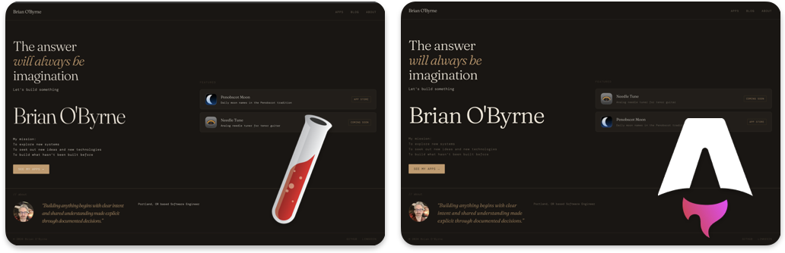

Migrating a site of any size can be a complicated task. It used to mean a browser full of tabs, docs in one, your repo in another, Stack Overflow in a third. Now days it's more likely that you have a single window open, a chat window with your favorite Ai model, be that one provided by OpenAI or in my case, one provided by Anthropic, Claude.

There are times when even that isn't enough and here's why: All Ai models have a knowledge cut off date baked in. This means that your shiney new Ai Model contains out of date training knowledge as soon as it comes online.

Meanwhile, in software development, all of the libraries, and packages that make up the various components of your favorite software frameworks have their own release cycle.

Most of the time this is fine, Claude and other LLM's are really decent (this is subjective of course, but let's pretend we agree, or at minimum, agree that they are fast) at building software. Sooner or later though, you start to feel some friction, something feels off. As the token count increases, and the context fills up, you have to ask yourself: what gives? What am I missing.

### Model Context Protocol (MCP)

Today let's focus on one piece of that missing link: Model Context Protocol (MCP).

I'll show you how we moved this site from Jekyll to Astro using just one MCP connector: **Astro's official docs server**. It plugged directly into our workflow, and the difference was immediate.

Here is the actual command to to add the mcp sever at the project scope level, which is the right scope when you want to share config at the repository level.

From your terminal:

```bash
claude mcp add --transport http astro-docs --scope project https://mcp.docs.astro.build/mcp
```

We can confirm it's connected by running: `claude mcp get <name>`

```bash
claude mcp get astro-docs
astro-docs:
  Scope: Project config (shared via .mcp.json)
  Status: ✔ Connected
  Type: http
  URL: https://mcp.docs.astro.build/mcp
```

Looks good. Because we added `--scope project` the actual `.mcp.json` config file is added to our repo and ready to be saved into version control.

```json
{
  "mcpServers": {
    "Astro docs": {
      "type": "http",
      "url": "https://mcp.docs.astro.build/mcp"
    }
}
```

**Astro's MCP server** meant we were never guessing. Instead of searching for a doc page and hoping it matched our version, we could ask directly and get an answer sourced from Astro's current documentation. Claude knew just what to do and just how to do it, without guessing.

### What the homepage actually looked like, before and after



Side by side, the migration itself reads as almost a non-event — the dark, warm design, the copy, the layout all carried straight over. (Some minor differences but all pretty trival) That was the point: the risk was in the toolchain underneath, not in how the site looks.

Although I ultimatley decieded to take the design of the site into a new direction, I felt it was important to showcase how simple the intial migration went with just a single MCP connector.

The pattern is simple: when your tools are connected directly into the context where you're working, the friction that normally comes with migrating, hunting for the right doc, jumping apps to check a repo state, mostly disappears. We spent our time building, not searching.

That's the real takeaway. Not Jekyll versus Astro (which is another story). Just what happens when the tools you need are already in the room.
